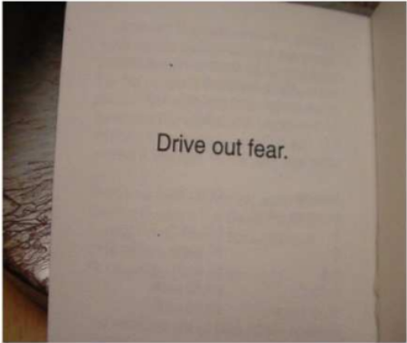

# The Little Blue Book 2nd Edition

A curated compilation of Dr. Deming's quotations originally published by Sundial Press (Fort Lauderdale) in 1994.

"We record the sunny hours"

*Converted into markdown by **Christopher R. Chapman** - April 2025*

[Take me to the quotations!](doc/little_blue_book.md)

##  From the original book...

*These quotations by Dr. Deming appear in this book as part of an on-going effort to spread awareness of the use of statistics and the role of variation in management. The purpose of this book is to reach educators, teachers and the people they work with. Profits from the sale of the book support the distribution of this book to schools, industrial and commercial management and educational leaders. Your purchase of two books allows the publisher to donate another book to a library, a school or a manager in crisis. This file also appears on scribd.com for free download. (So why would you buy the book? Because your mom, like our moms, doesn’t want to read an ebook.) If you want to use these quotes in your own edition of Deming’s quotes, please consider the concept of Creative Commons: work with us to get these words out to the general public. Most of the net proceeds from the sale of formats of this work are invested in giving away additional copies. Photos that appear in the book are from Creative Commons (wikipedia.org) and a portion of the proceeds from the sale of the book (and the income that comes from any advertising related to the youtube channel) goes to support wikipedia.org (shared with paying for the free distribution of the book to people and libraries).*

---

### Introduction  
The purpose of this book of quotations is neither to summarize Dr. Deming’s work nor to “popularize” his ideas by giving the reader a quick overview. This book does not give you the *essence* of Deming. Rather, the purpose of compiling these quotes is to stir your interest to learn more. **Why does Deming advocate the end of merit pay? Why must managers understand terms like “statistical control” and “variation”?** You won’t find complete answers here, just quotations for you to meditate on and to ponder. The page references will speed your self-education. Yes, today’s world of sound bites, briefings, news summaries and shortened attention spans make Dr. Deming’s work hard to communicate to a generation growing up on MTV and the Internet and to a work force committed to intense adversarial competition. Rather than try to chop Deming’s philosophy of “managing the system” into 20-second sound bites, we have selected quotes that will raise your interest to spend a half hour or more to learn more about the subject.

### The 14 Points  
We decided to include just three of Dr. Deming’s famous 14 points. If you are moved to find the list of the 14 points and the seven diseases, then *The Little Blue Book* has achieved its main purpose: to motivate you to read *Out of the Crisis* and other tomes that explain the Deming philosophy of management.

We have not included all of the 14 points and we have omitted the extensive explanations of each point that Deming, his disciples and interpreters have invested many years in developing. This *Little Blue Book* will get you started.  

—**The Editors**

---

### The Little Blue Book
Without a cultural revolution in management, **quality** control will not produced the desired effects in America. —W. Edwards Deming, *Out of the Crisis*, p. 148

In his foreword to the second edition of *Quotations From Chairman Mao Tse-Tung*, Lin Piao exhorted his readers to “have specific problems in mind, study and apply his [Mao’s] words in a creative way, combine study with application.” The reader of this little book is encouraged to apply the same advice to Dr. Deming’s words.

Students of Chinese history will recall that the phrase “cultural revolution” and a certain little red book intended to provide the guiding principles for modernizing a country or one billion people. Unlike Deng, whose work empowers those who understand and use the ideas, Mao Tse Tung (Zedong) perverted the phrase “cultural revolution” so that those two words continue to revive painful memories in millions of survivors of that ill-conceived plan.

We hope that these quotations from Dr. Deming’s work will inspire you to join the larger “cultural revolution” in management. This revolution will change not only you, your colleagues, your employees and your neighbors, but also billions of people around the globe, including those who studied Chairman Mao’s little red book and failed to find fulfillment. “Peace through economic prosperity” is Dr. Deming’s promise to those who heed his call for the pursuit of **quality**. [Let’s begin.](doc/little_blue_book.md)

—**The Editors**

---

### Endnotes  
In 1992 **Richard Stockton Conger**, a political science student at the University of Hawaii in Honolulu, compiled a collection of quotations by looking through his notes from lectures by Deming. His 48-page book measured 11 cm by 11 cm and it had a blue cover. The current editors in 1994 obtained permission letters and reissued the book in a smaller format (smaller than a 3” by 5” card) of 72 pages, calling it “the Little Blue Book.” In 2010 the document was placed on scribd.com with the purpose of sharing the work with people who are concerned about improving the **quality** of management, services and products.

You are invited to share this document, post it wherever you like, as long as you don’t remove any of the current quotes and make it clear if you add quotes. Please respect the spirit of Creative Commons and copyleft: You can add to the work and redistribute it as long as you don’t benefit from it directly by selling it and as long as the original book’s contents are presented.

By taking time to copy and distribute this file, you honor the spirits of all who helped to bring you this collection.

### About the editors of the Second Edition:

We admire Deming’s work and through this quote book we hope to share our passion and respect for his thoughts. We learned more by using these quotes and we hope your thinking will evolve, too. Write to us with your comments and suggestions for improving the next edition of this book.

---

### Other Topics

**Bluefin Tuna**

bigmarinefish.com/bluefin  

I will avoid eating all types of tuna (just to be sure).  
I will ask politicians for a ban on selling tuna (the ban can expire after ten years, enough time for the tuna stocks to recover).

If you are reading this collection as an ebook, consider buying the book and visiting the YouTube channel. Most of the net proceeds from the sale and advertising of formats of this work are invested in giving away additional copies. The editors do not benefit from the proceeds of this work. Photos that appear in the book are from Creative Commons (wikipedia.org) and a portion of the proceeds from the sale of the book (and the income that comes from any advertising related to the YouTube channel) goes to support wikipedia.org (shared with paying for the free distribution of the book to people and libraries).

**Drive out fear.**
(One of Deming's 14 Points)

